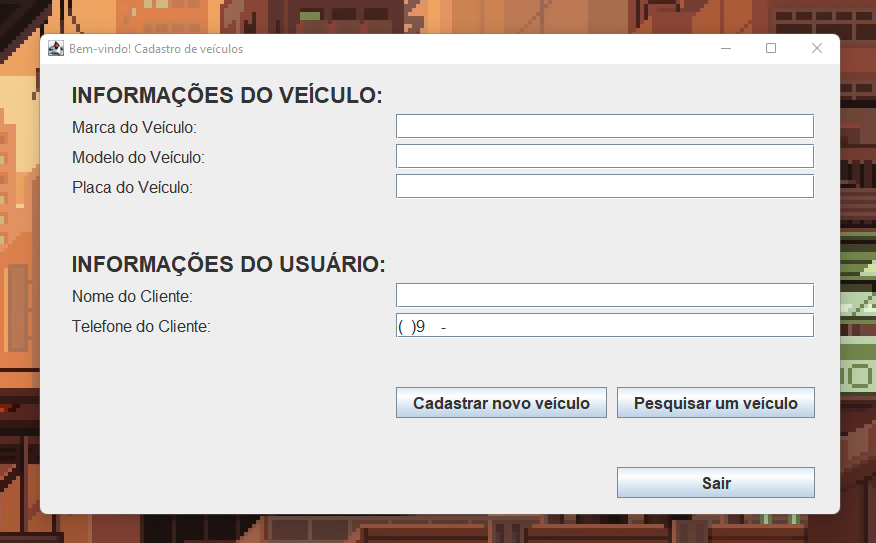

# <h1 align="center">📚 Avaliação Final - Programação Orientada a Objetos II</h1>

> Avaliação aplicada pelo professor Adriano Maia.

## 📢 Sobre a Questão

Devemos criar um programa utilizando a biblioteca JFrame que será responsável por cadastrar um utilizador
num determinado sistema. Onde um funcionário terá total acesso ao sistema para adicionar, ou buscar um veiculo pertencente a um usuário.

A aplicação deverá ser construída em Java, utilizando a biblioteca JFrame e as ações devem ser em runtime.

### 📋 Critérios avaliados

1. Criar mascarás para o Número telefonico.;
2. Campos definidos na ‘questão’ devem ser obrigatórios;
3. O funciário deve conseguir cadastrar, e pesquisar um carro pertencente a um usuário;
4. Código precisa ser autoral e se possível é desejável validação;

## 🎯 Ferramentas utilizadas no desenvolvimento da aplicação:

- `Java 18`
- `openjdk-18-jre`
- `openjdk-18-jdk`
- `MAVEN`
- `IntelliJ IDEA`
- `GIT`
- `GH CLI`

## 📚 Oque está sendo entregue

Nessa aplicação o usuário poderá cadastrar e visualizar um carro pertencente 
a um usuário. A aplicação foi construida levando em conta os principios do 
SOLID além de possuir validações e testes unitários.

Para uma compravação de um código funcinal, foi utilizado do [GitHubActions](https://github.com/features/actions) responsável por ci/cd,
que testará o código e verificará se funciona corretamente em cada `push` e `pull-request` feita no repo.

Para gerar um arquivo executável foi utilizado um script que gerava um `.jar` a cada versão da aplicação.

Em conjuto a aplicação foi feito testes unitários, para verificar se as classes e as suas respetivas funcionalidades
funcionam corretamente. Para validar o código, foi utilizado o [JUnit](https://junit.org/), em conjunto com as actions do GitHub.

## 🦥 Futuras atualizações

Na aplicação, pode-se encontrar alguns _TODOS_ que vão ser implementados como forma extra a avaliação, com 
o intuito de melhorar a qualidade do código.

- [ ] `Adaptação da classe UTILS`: Será removido algumas lógicas repetitivas, que de alguma forma poderam ser 
  reaproveiadas em mais de um contexto para o Utils.
- [ ] `Reescrita de algumas regras de négocio`: Será reescrita algumas regras de négocio para melhorar a desempenho da 
  aplicação.
- [ ] `Criar testes unitarios para a aplicação`: Será criado testes unitários para as classes, assim assegurando a 
  completa estabilidade do software.
- [ ] `Criar classes de exception para as determinadas classes: User & UserActions`: Será criado uma classe de 
  exception para, conseguirmos tratar as exceções que acontecem na aplicação.
- [ ] `Pequenos ajustes na interface`: Será realizado alguns ajustes na interface, para melhorar a experiência do 
  usuário.

## 🚀 Releases

Cada release foi gerada por uma `Command Line Interface` (CLI) chamada [GitHub CLI](https://cli.github.com/).
As releases são categorizadas por versão da aplicação, onde cada uma possui um nome e um arquivo executável.

Caso queira uma release mais recente ou especifica, basta [clicar aqui](https://github.com/deverebor/vehicle-registration/releases/).

---

  Developer with ❤️‍🔥 by Lucas Souza (@deverebor)

